# aws-study-architecture

AWSの基本的なWebアプリケーション構成を学習・整理するためのリポジトリです。  
VPC、ALB、EC2、RDS（MySQL）を用いた **マルチAZ構成のインフラ構成図** を作成しています。

---

## 📐 インフラ構成図

本リポジトリで作成したAWSインフラ構成図です。



※ 構成図は draw.io（diagrams.net）で作成しています。  
編集用ファイルは `architecture.drawio` を参照してください。

---

## 🌏 リージョン

- **ap-northeast-1（東京リージョン）**

---

## 🧱 構成概要

本構成は、以下のようなWebアプリケーションを想定しています。

- インターネット公開型Webアプリ
- 可用性を考慮したマルチAZ構成
- アプリケーション層とデータベース層の分離

---

## 🏗 使用サービスと役割

### ネットワーク

- **VPC**
  - CIDR: `10.0.0.0/21`
- **Internet Gateway**
  - インターネット通信を提供

### サブネット構成（2AZ）

#### パブリックサブネット
- `10.0.0.0/24`（AZ-a）
- `10.0.1.0/24`（AZ-c）
- ALBを配置

#### アプリケーション用プライベートサブネット
- `10.0.2.0/24`（AZ-a）
- `10.0.3.0/24`（AZ-c）
- EC2を配置

#### データベース用プライベートサブネット
- `10.0.4.0/24`（AZ-a）
- `10.0.5.0/24`（AZ-c）
- RDS（MySQL）を配置

---

## ⚖️ ロードバランシング

- **Application Load Balancer（ALB）**
  - パブリックサブネットに配置
  - インターネットからのHTTP/HTTPS通信を受信
  - EC2へリクエストを分散

---

## 💻 コンピューティング

- **EC2**
  - プライベートサブネットに配置
  - ALBからの通信のみを許可
  - アプリケーションを実行

---

## 🗄 データベース

- **RDS（MySQL）**
  - プライベートサブネットに配置
  - EC2からのみ接続可能
  - データ層を分離しセキュリティを確保

---

## 🔐 セキュリティ設計

- Security Group による通信制御
  - Internet → ALB（HTTP/HTTPS）
  - ALB → EC2
  - EC2 → RDS（MySQL）
- データベースはインターネット非公開

---

## 🛠 使用ツール

- diagrams.net（draw.io）
- Visual Studio Code（Draw.io Integration）

---

## 📂 リポジトリ構成

```text
aws-study-architecture/
├── README.md
├── architecture.drawio
└── architecture.svg
